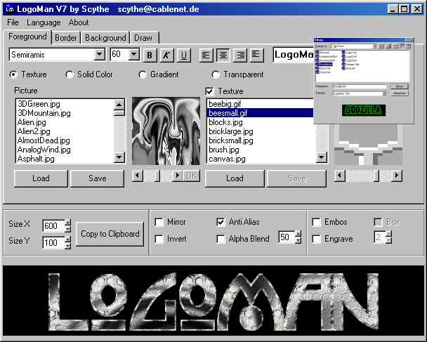



## LogoMan VII

### Description

Creates Logos on the Fly. Look at the Screenshot. Using on of the over 40 Effects Hover Font (Like Windows Shadow), Glowing Border, Fading Border, Gradients, Change Textures Brightnes, Supports any True Type Font, AntiAlias Alpha Blend, Mirror Font, Embos or Engrave Font, Deform texture using Embos/Engrave,Invert Background evrywhere the Font hits,Backlight Text like MIB Logo, Set Textures / Gradients / Single Colors for the Font, Set Borders with Textures / Gradient / Single Color / Glow Effekt,Fade Effekt, Choose Bordersize & Sides (Left,Right, Up, Down), Use any Picture as Texture, Load any Picture as Background and Shrink/Stretch/Tile it if u like, Finish ur Logo using folowing functions, Draw (Points/Lines/Boxes) Use Filters (Monochrome/Blur/De Pixel/Negative), Bend the Logo Create relistic Shadows, Multilanguage Support (Make ur own Language pack in 5 mins) Save ur Logo or Copy it to the Clipboard, New and easyer GUI,Save and Load your Logos as LMF, File assotiation, Preview for Loading, ..... Comes with 120 Textures and 46 Embos Pictures in English/German/Serbian Language and a Translator Tool.
 
### More Info
 

             |
---                |---
**Submitted On**   |2003-03-03 09:29:12
**By**             |[Scythe](https://github.com/Planet-Source-Code/PSCIndex/blob/master/ByAuthor/scythe.md)
**Level**          |Advanced
**User Rating**    |5.0 (90 globes from 18 users)
**Compatibility**  |VB 5\.0, VB 6\.0
**Category**       |[Complete Applications](https://github.com/Planet-Source-Code/PSCIndex/blob/master/ByCategory/complete-applications__1-27.md)
**World**          |[Visual Basic](https://github.com/Planet-Source-Code/PSCIndex/blob/master/ByWorld/visual-basic.md)
**Archive File**   |[LogoMan\_VI155383332003\.zip](https://github.com/Planet-Source-Code/scythe-logoman-vii__1-43697/archive/master.zip)

